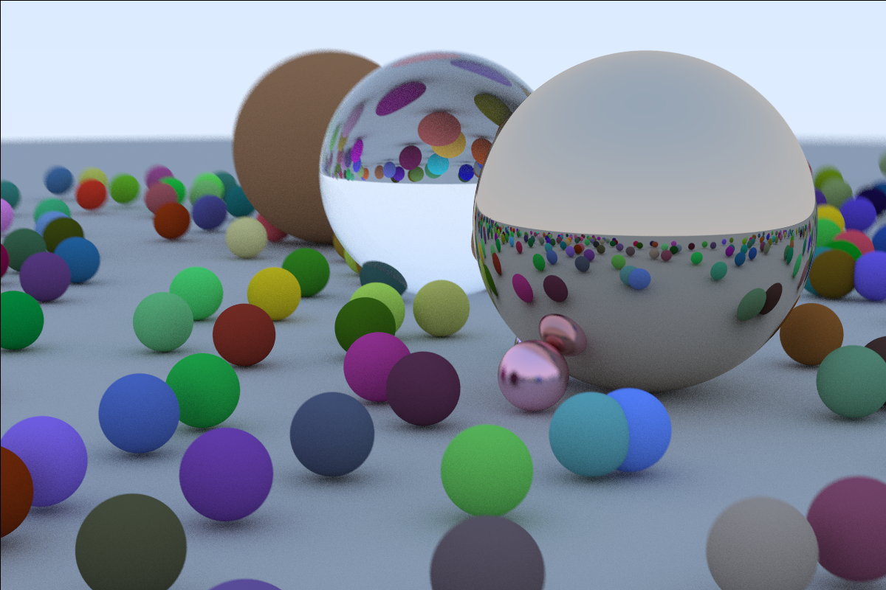

# Ray tracing using rust

Implementation of ray tracing (https://raytracing.github.io/books/RayTracingInOneWeekend.html) using `rust`.

## Output

Run `cargo run --release` to generate the ray-traced image.

